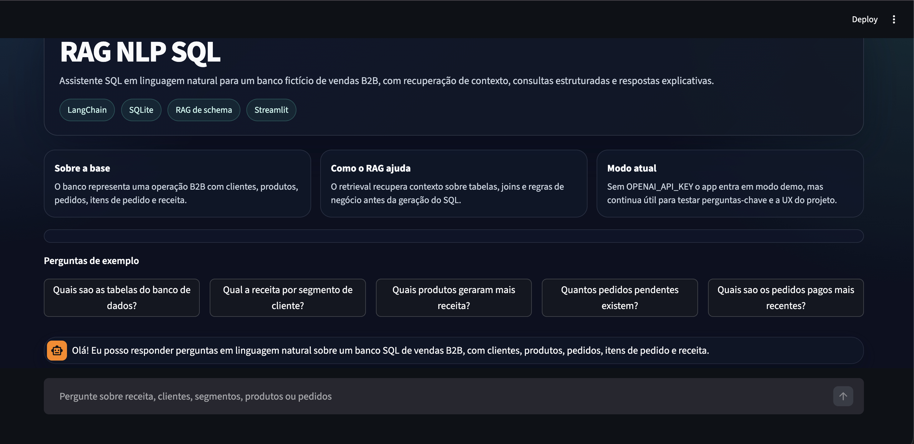

# RAG NLP SQL

## PT-BR

Projeto em Python que combina `LangChain`, `OpenAI` e `SQLite` para responder perguntas em linguagem natural sobre um banco de dados SQL. A solução usa recuperação de contexto (`RAG`) sobre documentação semântica do schema e depois delega a geração e execução do SQL a um agent LangChain.

### O que este projeto faz

- aceita perguntas em linguagem natural;
- recupera contexto relevante sobre tabelas, regras de negócio e dicas de consulta;
- gera SQL automaticamente com `LangChain`;
- executa a consulta em um banco `SQLite`;
- devolve uma resposta em linguagem natural com base no resultado.

### Interface



### Arquitetura

O fluxo principal é:

1. O banco de exemplo é criado localmente em `SQLite`.
2. Documentos de contexto sobre schema e regras de negócio são carregados.
3. Um `BM25Retriever` seleciona os trechos mais relevantes para a pergunta do usuário.
4. Esse contexto recuperado é injetado no prompt do agent SQL.
5. O `create_sql_agent` do LangChain decide quais tabelas inspecionar, gera SQL e consulta o banco.
6. O resultado é resumido em linguagem natural.

### Stack Técnica

- `LangChain`
- `langchain-community`
- `langchain-openai`
- `SQLAlchemy`
- `SQLite`
- `Streamlit`
- `BM25Retriever`

### Estrutura do Projeto

- `app.py`: interface de chat em Streamlit
- `main.py`: versão CLI para testar perguntas no terminal
- `src/sample_database.py`: criação e carga do banco SQLite
- `src/rag_context.py`: documentos de contexto usados no retrieval
- `src/sql_rag_agent.py`: agent SQL com LangChain e recuperação de contexto
- `tests/test_database.py`: teste básico de criação e carga do banco

### Como Executar

1. Crie um ambiente virtual:

```bash
python3 -m venv .venv
source .venv/bin/activate
```

2. Instale as dependências:

```bash
pip install -r requirements.txt
```

3. Crie um arquivo `.env` com base em `.env.example` e configure sua chave:

```bash
OPENAI_API_KEY=your_key_here
OPENAI_MODEL=gpt-4o-mini
DATABASE_URI=sqlite:///data/company_sales.db
```

4. Rode a interface:

```bash
streamlit run app.py
```

### Modo Demo x Modo Completo

Este projeto possui dois modos de uso:

- `Modo demo`: funciona mesmo sem `OPENAI_API_KEY`. Nesse caso, a interface continua operacional e responde algumas consultas pré-mapeadas sobre o banco fictício, o que é útil para demonstração local e portfólio.
- `Modo completo`: com `OPENAI_API_KEY` configurada, o projeto usa `LangChain + OpenAI` para recuperar contexto semântico, montar SQL dinamicamente e responder perguntas mais abertas em linguagem natural.

Em resumo:

- sem chave: experiência demonstrável e offline;
- com chave: fluxo real de agent SQL com geração dinâmica de consultas.

### Segurança da Base de Dados

O app não recria automaticamente bancos configurados pelo usuário.

- se você estiver usando a base demo padrão, o projeto cria o SQLite de exemplo apenas quando ele ainda não existe;
- se você definir `DATABASE_URI` para outro banco, o app não faz seed automático nem tenta sobrescrever seus dados.

Isso permite adaptar o projeto para um ambiente real com mais segurança.

### Exemplos de perguntas

- `What is the total paid revenue by customer segment?`
- `Which products generated the most revenue?`
- `How many pending orders do we have?`
- `List the most recent paid orders.`

### Observação

Este projeto é um exemplo de RAG aplicado a SQL analytics. O retrieval não busca documentos externos; ele busca contexto interno sobre schema, regras e exemplos semânticos, que orientam a geração do SQL.

### Como Adaptar Para Dados Reais

Para aplicar esse projeto ao seu contexto real, o caminho mais direto é:

1. trocar o banco de exemplo por sua conexão real em `src/config.py`;
2. substituir os documentos em `src/rag_context.py` por descrições reais do seu schema, regras de negócio, nomenclaturas e exemplos de consulta;
3. ajustar o domínio do banco para sua empresa, como financeiro, RH, e-commerce, CRM ou supply chain;
4. manter a interface e o fluxo do agent, trocando apenas a fonte de dados e o contexto recuperado.

Na prática, o valor do projeto está justamente nessa separação:

- o banco fornece os dados estruturados;
- o contexto RAG fornece conhecimento semântico sobre o negócio;
- o agent transforma perguntas naturais em SQL utilizável.

### Versão de Python Recomendada

Para o modo completo com `LangChain + OpenAI`, a recomendação prática é usar Python `3.11` ou `3.12`.

O projeto funciona localmente em modo demo neste ambiente, mas algumas dependências do ecossistema LangChain ainda emitem avisos de compatibilidade em Python `3.14`.

---

## EN

Python project that combines `LangChain`, `OpenAI`, and `SQLite` to answer natural-language questions over a SQL database. The solution uses context retrieval (`RAG`) over semantic schema documentation and then delegates SQL generation and execution to a LangChain agent.

### What this project does

- accepts natural-language questions;
- retrieves relevant context about tables, business rules, and query hints;
- automatically generates SQL with `LangChain`;
- executes queries against a `SQLite` database;
- returns a natural-language answer grounded in the query result.

### Interface


### Architecture

The main flow is:

1. A local sample database is created in `SQLite`.
2. Context documents about schema and business rules are loaded.
3. A `BM25Retriever` selects the most relevant context chunks for the user question.
4. That retrieved context is injected into the SQL agent prompt.
5. LangChain `create_sql_agent` decides which tables to inspect, generates SQL, and queries the database.
6. The result is summarized in natural language.

### Technical Stack

- `LangChain`
- `langchain-community`
- `langchain-openai`
- `SQLAlchemy`
- `SQLite`
- `Streamlit`
- `BM25Retriever`

### Project Structure

- `app.py`: Streamlit chat interface
- `main.py`: CLI version for terminal testing
- `src/sample_database.py`: SQLite creation and seeding
- `src/rag_context.py`: context documents used by retrieval
- `src/sql_rag_agent.py`: SQL agent with LangChain and context retrieval
- `tests/test_database.py`: basic database creation and seeding test

### Run

1. Create a virtual environment:

```bash
python3 -m venv .venv
source .venv/bin/activate
```

2. Install dependencies:

```bash
pip install -r requirements.txt
```

3. Create a `.env` file based on `.env.example` and configure your key:

```bash
OPENAI_API_KEY=your_key_here
OPENAI_MODEL=gpt-4o-mini
DATABASE_URI=sqlite:///data/company_sales.db
```

4. Launch the interface:

```bash
streamlit run app.py
```

### Demo Mode vs Full Mode

This project supports two usage modes:

- `Demo mode`: works even without `OPENAI_API_KEY`. In this case, the interface remains usable and answers a few predefined queries over the fictional database, which is useful for local demos and portfolio presentation.
- `Full mode`: with `OPENAI_API_KEY` configured, the project uses `LangChain + OpenAI` to retrieve semantic context, generate SQL dynamically, and answer broader natural-language questions.

In short:

- without an API key: demonstrable offline experience;
- with an API key: real SQL agent workflow with dynamic query generation.

### Database Safety

The app does not automatically recreate user-configured databases.

- if you are using the default demo database, the project creates the sample SQLite file only when it does not already exist;
- if you set `DATABASE_URI` to another database, the app does not seed data automatically and does not try to overwrite your data.

This makes the project safer to adapt to real environments.

### Example questions

- `What is the total paid revenue by customer segment?`
- `Which products generated the most revenue?`
- `How many pending orders do we have?`
- `List the most recent paid orders.`

### Note

This project is an example of RAG applied to SQL analytics. The retrieval layer does not search external documents; it retrieves internal schema context, business rules, and semantic hints that improve SQL generation.

### How To Adapt It To Real Data

To apply this project to a real business setting, the most direct path is:

1. replace the sample database connection in `src/config.py` with your real database connection;
2. replace the documents in `src/rag_context.py` with real schema descriptions, business rules, naming conventions, and query examples;
3. adapt the business domain to your company, such as finance, HR, e-commerce, CRM, or supply chain;
4. keep the interface and agent workflow, changing only the data source and retrieved context.

In practice, the main value of the project comes from this separation:

- the database provides structured data;
- the RAG context provides semantic business knowledge;
- the agent converts natural-language questions into usable SQL.

### Recommended Python Version

For the full `LangChain + OpenAI` mode, the practical recommendation is to use Python `3.11` or `3.12`.

The project runs locally in demo mode in this environment, but some LangChain ecosystem dependencies still emit compatibility warnings on Python `3.14`.
